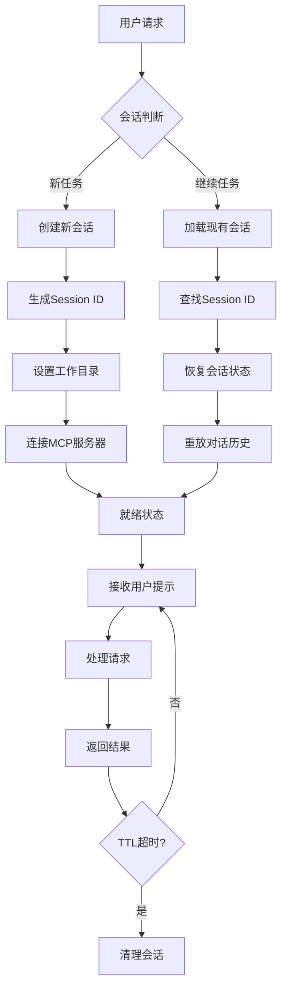
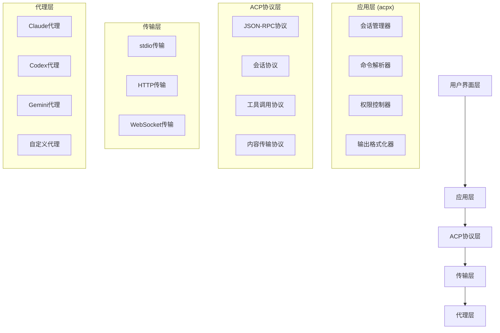
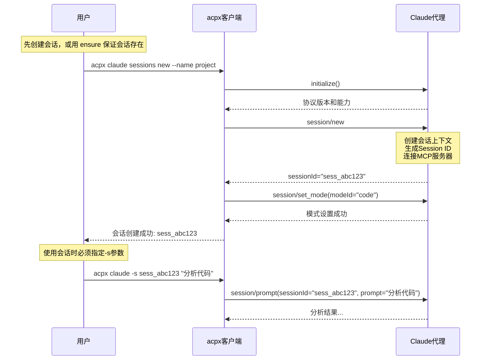

# ACP/acpx/Claude 会话机制完整指南

> **版本**: 3.1.0 (修正版) | **最后更新**: 2026-03-30  
> **适用对象**: 开发者、技术管理者、AI工具用户  
> **主要代理**: Claude (推荐)  
> **文档类型**: 技术参考手册

---

## 第一部分：基础概念

### 1.1 ACP协议简介

**Agent Client Protocol (ACP)** 是一个标准化协议，用于 AI 编码代理和代码编辑器/IDE 之间的通信，类似于语言服务器协议（LSP）之于语言工具生态系统的作用。

**核心价值**:
- 标准化通信：统一的JSON-RPC协议
- 完整互操作性：实现ACP的代理可与任何兼容编辑器工作
- 自由选择：开发者可独立选择最佳工具组合

**官方网站**: https://agentclientprotocol.com

### 1.2 acpx是什么？

`acpx` 是基于 ACP 协议的无头、可脚本化 CLI 客户端，专为命令行中的代理间通信而构建。

**支持的代理**:
- **`claude`** - Claude代理（推荐使用）
- `codex` - Codex代理
- `gemini` - Gemini代理
- `opencode` - OpenCode代理
- `pi` - Pi代理

### 1.3 Claude的五大核心优势

1. **架构设计** - 擅长系统架构分析和设计
2. **文档编写** - 优秀的自然语言处理和文档生成能力
3. **复杂分析** - 强大的逻辑推理和问题分析能力
4. **代码审查** - 全面的代码质量检查和改进建议
5. **上下文理解** - 支持较长上下文，理解复杂需求

---

## 第二部分：安装与配置

### 2.1 安装acpx CLI

```bash
# 全局安装（推荐）
npm install -g acpx@latest

# 使用npx（无需安装）
npx acpx@latest
```

### 2.2 配置文件

在 `~/.acpx/config.json`:

```json
{
  "defaultAgent": "claude",
  "defaultPermissions": "approve-reads",
  "ttl": 300,
  "timeout": null,
  "format": "text"
}
```

---

## 第三部分：ACP会话机制详解

### 3.1 会话(Session)是什么？

ACP 会话是 Client（如 acpx）与 Agent（如 Claude）之间的特定对话容器，每个会话都会维护自己的：

| 组件 | 描述 | 重要性 |
|------|------|--------|
| **上下文(Context)** | 对话历史、用户意图、环境信息 | 保持对话连续性 |
| **会话历史** | 完整的消息交换记录 | 支持恢复和回溯 |
| **会话状态** | 当前模式、权限设置、工具状态 | 控制代理行为 |

### 3.2 会话创建机制

`acpx` 的会话创建机制可以概括为一句话：

> **发送 prompt 之前，必须先有一个可用的保存会话；`acpx` 不会在 prompt 阶段隐式新建这个会话。**

这意味着：
- `acpx claude "任务"` 不是“随手发一句话就自动生成一个新的持久会话”
- 如果当前作用域下没有可用会话，这类命令会失败，而不是帮你偷偷创建
- 你需要先准备会话，再在该会话里持续对话

**准备会话有两种方式**:

| 方式 | 命令 | 语义 | 适用场景 |
|------|------|------|----------|
| 显式新建 | `acpx claude sessions new --name myproject` | 总是创建一个新会话 | 你要开启全新的上下文 |
| 确保存在 | `acpx claude sessions ensure --name myproject` | 有则复用，无则创建 | 脚本、CI、重复执行的流程 |

**错误示例**:
```bash
# ❌ 错误：假设 prompt 会自动创建并保存会话
acpx claude "任务1"
acpx claude "任务2"
```

**正确示例1：先新建，再继续使用**:
```bash
acpx claude sessions new --name myproject
acpx claude -s myproject "任务1"
acpx claude -s myproject "任务2"  # 上下文保持
```

**正确示例2：先 ensure，再继续使用**:
```bash
acpx claude sessions ensure --name myproject
acpx claude -s myproject "任务1"
acpx claude -s myproject "任务2"  # 上下文保持
```

**正确示例3：先新建默认session，再继续使用**:
```bash
acpx claude sessions new
acpx claude "任务1"
acpx claude "任务2"  # 上下文保持
```


**为什么容易误解**:
- 从协议角度看，会话建立本来就是独立步骤，对应 `session/new` 或 `session/load`
- 从 CLI 角度看，用户更容易把 `acpx claude "任务"` 理解成“像聊天工具一样直接开聊”
- 实际上，`acpx` 对持久上下文的处理更接近“先准备会话，再进入会话”

**实务建议**:
- 临时开启全新任务时，用 `sessions new`
- 不确定会话是否已存在时，用 `sessions ensure`
- 只做一次性分析、不需要上下文延续时，用 `exec`

### 3.3 会话生命周期



---

## 第四部分：acpx会话管理

### 4.1 正确的会话创建与使用

#### 必须遵循的步骤：

1. **准备会话**（先创建，或确保存在）
   ```bash
   # 方法1：创建基于当前目录的默认会话
   cd /home/user/project
   acpx claude sessions new
   
   # 方法2：创建命名会话
   acpx claude sessions new --name myproject

   # 方法3：幂等确保会话存在（推荐用于脚本）
   acpx claude sessions ensure --name myproject
   ```

2. **使用会话**（必须指定-s参数）
   ```bash
   acpx claude -s myproject "任务1"
   ```

3. **继续同一会话**（保持上下文）
   ```bash
   acpx claude -s myproject "任务2"
   acpx claude -s myproject "任务3"
   ```

### 4.2 会话操作命令

| 命令 | 描述 | 示例 |
|------|------|------|
| `sessions new` | 创建新会话 | `acpx claude sessions new --name auth` |
| `sessions ensure` | 返回现有会话；不存在时自动创建 | `acpx claude sessions ensure --name auth` |
| `sessions list` | 列出所有会话 | `acpx claude sessions list` |
| `-s [id]` | 指定会话执行 | `acpx claude -s sess_abc123` |
| `sessions info` | 查看会话详情 | `acpx claude sessions info sess_abc123` |
| `sessions delete` | 删除会话 | `acpx claude sessions delete sess_abc123` |
| `sessions cleanup` | 清理过期会话 | `acpx claude sessions cleanup --days 7` |

### 4.2.1 `sessions ensure` 详解

`sessions ensure` 是一个**幂等**会话准备命令，适合在脚本、CI 和可重复执行的工作流里使用。

**它做什么**:
- 如果当前作用域下已经有匹配的会话，就直接返回该会话
- 如果没有匹配会话，就自动创建一个新的会话
- 因而它的语义不是“强制新建”，而是“确保这里有一个可用会话”

**什么叫作用域**:
- `acpx` 会按目录作用域匹配会话
- 它会从当前目录（或 `--cwd` 指定目录）向上查找到最近的 Git 根目录，并在这个范围内寻找匹配会话
- 如果使用了 `-s <name>` 或 `--name <name>`，还会把会话名纳入匹配条件

**它和 `sessions new` 的区别**:

| 命令 | 行为 | 适合场景 |
|------|------|----------|
| `sessions new` | 总是创建一个新会话；同作用域旧会话会被软关闭 | 你明确想开启一个全新上下文 |
| `sessions ensure` | 有就复用，没有才创建 | 脚本化调用、重复执行、初始化流程 |

**最常见用法**:
```bash
# 1. 在当前项目里确保存在默认会话
acpx claude sessions ensure

# 2. 确保存在一个命名会话
acpx claude sessions ensure --name backend

# 3. 后续在该会话里继续工作
acpx claude -s backend "继续实现认证逻辑"
```

**为什么脚本里更推荐它**:
- 可重复执行，不怕第一次和第二次行为不同
- 不会因为脚本重复运行而不断制造新会话
- 更适合“先保证环境就绪，再发送 prompt”的自动化流程

**典型脚本模式**:
```bash
#!/bin/bash

# 先确保会话存在
SESSION_ID=$(acpx claude sessions ensure --name release-review --format json | jq -r '.sessionId')

# 再持续使用该会话
acpx claude -s $SESSION_ID "审查这次发布涉及的主要风险"
acpx claude -s $SESSION_ID "基于上面的结论给出发布建议"
```

**与直接 prompt 的关系**:
- `acpx claude "任务"` 依赖当前作用域下已有保存会话记录
- 如果你不能确定该作用域是否已有会话，先执行一次 `sessions ensure` 会更稳妥
- `exec` 不属于这套机制；它始终是一次性执行，不复用保存会话

### 4.2.2 不指定 session 名称时的行为

不指定 `--name` 时，`acpx` 使用的是**当前作用域下的默认会话语义**。

**最常见的两种写法**:
```bash
# 创建当前作用域下的默认会话
acpx claude sessions new

# 确保当前作用域下存在默认会话
acpx claude sessions ensure
```

**这里的“默认会话”是什么意思**:
- 它不是你手动命名的会话
- 它依附于当前目录作用域
- 后续如果该作用域下只有一个可用默认会话，`acpx claude "任务"` 可以直接把 prompt 发到这个会话

**作用域如何确定**:
- `acpx` 会从当前目录开始向上查找
- 通常会以最近的 Git 根目录作为项目作用域
- 如果不在 Git 仓库中，则按当前工作目录环境处理
- 也可以通过 `--cwd` 显式指定作用域基准目录

**典型用法**:
```bash
# 1. 进入项目目录
cd /home/user/project

# 2. 确保当前项目有一个默认会话
acpx claude sessions ensure

# 3. 直接在该作用域下发送 prompt
acpx claude "分析项目结构"
acpx claude "继续分析核心模块"
```

**它适合什么场景**:
- 你只在一个项目里连续工作
- 不想给会话单独命名
- 希望命令更短，直接依赖当前目录上下文

**什么时候不建议这样用**:
- 同一项目里同时维护多个并行任务
- 你需要明确区分前端、后端、审查、修复等多个上下文
- 你在脚本里需要稳定引用某个确定会话

**这种情况下更适合命名会话**:
```bash
acpx claude sessions ensure --name backend
acpx claude -s backend "实现认证逻辑"
```

**实务建议**:
- 个人单任务、单项目工作流：可以直接用默认会话
- 多任务并行、自动化脚本、CI：优先使用命名会话

### 4.3 TTL（生存时间）管理

> **⚠️ 参数位置修正**  
> TTL 参数应放在主命令后、子命令前

```bash
# ✅ 正确：TTL在主命令后
acpx --ttl 300 claude -s mysession "任务"

# ❌ 错误：TTL在子命令后（不会生效）
acpx claude --ttl 300 -s mysession "任务"
```

**不同 TTL 配置**:
```bash
# 短时任务：3分钟
acpx --ttl 180 claude -s mysession "快速修复"

# 中等任务：15分钟
acpx --ttl 900 claude -s mysession "代码审查"

# 长期任务：禁用TTL
acpx --ttl 0 claude -s mysession "系统架构设计"

# 环境变量设置全局TTL
export ACPX_TTL=600  # 设置为10分钟
```

### 4.4 exec命令的正确使用

**`exec` 命令特点**:
- 用于一次性简单任务
- 不创建持久会话
- 执行后立即退出
- 适合快速问答和简单分析

```bash
# exec命令用法
acpx claude exec "简单问答或分析"

# 从文件读取提示
acpx claude exec --file prompt.txt

# 使用管道输入
echo "总结项目功能" | acpx claude exec
```

### 4.5 会话存储结构

```bash
~/.acpx/sessions/
├── claude/                    # Claude代理会话
│   ├── sess_abc123def456.json
│   ├── sess_xyz789ghi012.json
│   └── index.json           # 会话索引
├── codex/                    # Codex代理会话
│   ├── sess_123456.json
│   └── index.json
└── metadata.json            # 全局元数据
```

**会话文件格式**:
```json
{
  "sessionId": "sess_abc123def456",
  "agentType": "claude",
  "createdAt": "2025-10-29T14:22:15Z",
  "lastAccessed": "2025-10-30T09:15:22Z",
  "config": {
    "cwd": "/home/user/project",
    "mode": "code",
    "permissions": "approve-reads",
    "ttl": 300
  },
  "history": [...],
  "metadata": {...}
}
```

---

## 第五部分：多轮代码对话（Claude专用）

### 5.1 基本工作流

```bash
# 第1步：创建或确保会话存在
acpx claude sessions ensure --name project-review

# 第2步：使用会话进行分析
acpx claude -s project-review "分析项目整体架构"

# 第3步：继续同一会话深入分析
acpx claude -s project-review "详细分析核心模块设计"

# 第4步：基于上下文提出建议
acpx claude -s project-review "基于分析提出改进建议"
```

### 5.2 并行会话处理

**场景：同时处理前后端开发**

```bash
# 会话A：后端开发
acpx claude sessions new --name backend
acpx claude -s backend "设计用户认证API"
acpx claude -s backend "实现JWT验证"

# 会话B：前端开发
acpx claude sessions new --name frontend
acpx claude -s frontend "设计React登录组件"
acpx claude -s frontend "实现表单验证"
```

### 5.3 会话自动化脚本

```bash
#!/bin/bash
# 并行会话管理脚本

# 1. 为多个任务确保各自会话存在
SESSION_BACKEND=$(acpx claude sessions ensure --name backend-dev --format json | jq -r '.sessionId')
SESSION_FRONTEND=$(acpx claude sessions ensure --name frontend-dev --format json | jq -r '.sessionId')

# 2. 并行执行任务
acpx --ttl 600 claude -s $SESSION_BACKEND "实现用户认证API" &
acpx --ttl 600 claude -s $SESSION_FRONTEND "实现登录页面" &

# 3. 等待任务完成
wait

echo "并行任务完成"
```

---

## 第六部分：高级功能

### 6.1 输出格式管理

| 格式 | 命令 | 特点 |
|------|------|------|
| **文本格式** | `acpx --format text claude` | 人类可读，实时反馈 |
| **JSON格式** | `acpx --format json claude` | 结构化，易于解析 |
| **静默模式** | `acpx --format quiet claude` | 只输出结果，无干扰 |

### 6.2 权限管理策略

| 权限模式 | 描述 | 命令格式 |
|----------|------|----------|
| `--approve-all` | 自动化任务，无需人工干预 | `acpx --approve-all claude -s session` |
| `--approve-reads` | 安全审查，询问写入操作（默认） | `acpx --approve-reads claude -s session` |
| `--deny-all` | 只读分析，保护敏感数据 | `acpx --deny-all claude -s session` |

### 6.3 会话模式设置

ACP 支持三种核心模式：

| 模式ID | 模式名称 | 描述 | 适用场景 |
|--------|----------|------|----------|
| `ask` | 询问模式 | 在执行任何修改前请求权限 | 安全审查，敏感操作 |
| `architect` | 架构师模式 | 设计和规划软件系统，不执行实现 | 系统设计，架构评审 |
| `code` | 编码模式 | 编写和修改代码，完整工具访问 | 代码实现，功能开发 |

**设置模式**:
```bash
# 设置会话模式
acpx --mode architect claude -s arch "设计系统架构"
acpx --mode code claude -s code "实现具体功能"
```

---

## 第七部分：实用工作流

### 7.1 自动化代码审查（Claude版）

```bash
#!/bin/bash
# 自动化代码审查工作流

# 1. 确保审查会话存在
SESSION_ID=$(acpx claude sessions ensure --name auto-review --format json | jq -r '.sessionId')

# 2. 设置TTL为1小时
acpx --ttl 3600 claude -s $SESSION_ID "开始代码审查"

# 3. 执行代码质量分析
echo "=== 代码质量分析 ==="
acpx claude -s $SESSION_ID "分析项目代码质量" > code_quality.md

# 4. 执行安全检查
echo "=== 安全检查 ==="
acpx claude -s $SESSION_ID "检查安全漏洞" > security_check.md

# 5. 生成综合报告
echo "=== 生成综合报告 ==="
acpx claude -s $SESSION_ID "生成详细的代码审查报告" > final_report.md
```

### 7.2 CI/CD集成示例

```yaml
# .github/workflows/code-review.yml
name: Code Review with acpx

on:
  pull_request:
    branches: [main]

jobs:
  code-review:
    runs-on: ubuntu-latest
    
    steps:
    - uses: actions/checkout@v3
    
    - name: Setup Node.js
      uses: actions/setup-node@v3
      with:
        node-version: '18'
        
    - name: Install acpx
      run: npm install -g acpx@latest
      
    - name: Run Code Review
      run: |
        # 确保会话存在
        SESSION_ID=$(acpx claude sessions ensure --name "pr-${{ github.event.number }}" --format json | jq -r '.sessionId')
        
        # 审查代码变更
        acpx claude -s $SESSION_ID "审查以下代码变更: $(git diff HEAD~1)" > review.md
        
        # 提交评论
        cat review.md
```

---

## 第八部分：最佳实践

### 8.1 会话命名规范

| 命名模式 | 示例 | 适用场景 |
|----------|------|----------|
| **项目标识** | `project-backend-api` | 长期项目开发 |
| **任务类型** | `bugfix-login-issue` | 特定问题解决 |
| **时间标识** | `review-2025-10-30` | 定期审查任务 |
| **协作标识** | `team-devops-migration` | 团队协作项目 |

### 8.2 会话性能优化

**内存管理**:
```bash
# 监控内存使用
acpx claude sessions stats

# 清理历史会话
acpx claude sessions cleanup --days 7

# 设置内存限制
export ACPX_MAX_MEMORY_MB=1024
```

**响应优化**:
```bash
# 使用适当的历史长度
acpx --history-length 20 claude -s session "任务"

# 分块处理大任务
acpx --chunk-size 1000 claude -s session "处理大文件"
```

### 8.3 环境变量配置

```bash
# 全局TTL设置
export ACPX_TTL=600  # 10分钟

# 默认代理
export ACPX_DEFAULT_AGENT=claude

# 默认权限模式
export ACPX_DEFAULT_PERMISSIONS=approve-reads

# 输出格式
export ACPX_FORMAT=text

# 会话数量限制
export ACPX_MAX_SESSIONS=50
```

---

## 第九部分：故障排除

### 常见问题及解决方案

#### 1. "No acpx session found"
**问题**: 没有找到会话
**解决**:
```bash
# 先创建会话
acpx claude sessions new --name my-session

# 或者幂等地确保会话存在（更适合脚本）
acpx claude sessions ensure --name my-session

# 或使用exec命令进行一次性任务
acpx claude exec "简单任务"
```

#### 2. TTL参数不生效
**问题**: TTL参数位置错误
**解决**:
```bash
# ✅ 正确：TTL在主命令后
acpx --ttl 300 claude -s mysession "任务"

# ❌ 错误：TTL在子命令后
acpx claude --ttl 300 -s mysession "任务"
```

#### 3. 上下文丢失
**问题**: 每次命令都创建新会话
**解决**:
```bash
# 确保使用-s参数指定同一会话
acpx claude -s mysession "任务1"
acpx claude -s mysession "任务2"  # 保持上下文
```

#### 4. 会话状态异常
**问题**: 会话状态不一致
**解决**:
```bash
# 检查会话列表
acpx claude sessions list

# 清理并重新创建
acpx claude sessions delete mysession
acpx claude sessions new --name mysession
```

#### 5. 内存不足
**问题**: 会话占用过多内存
**解决**:
```bash
# 清理旧会话
find ~/.acpx/sessions -name "*.json" -mtime +7 -delete

# 限制会话历史长度
export ACPX_MAX_HISTORY_LENGTH=50

# 使用exec命令处理简单任务
acpx claude exec "简单问答"
```

---

## 第十部分：技术参考

### 10.1 ACP协议层次结构



### 10.2 会话创建流程（修正版）



### 10.3 会话状态管理

**关键状态字段**:
```javascript
{
  // 会话标识
  "sessionId": "sess_abc123def456",
  
  // 时间信息
  "createdAt": "2025-10-29T14:22:15Z",
  "lastAccessed": "2025-10-30T09:15:22Z",
  "lastActivityAt": "2025-10-30T09:15:22Z",
  
  // 配置信息
  "config": {
    "cwd": "/home/user/project",
    "mode": "code",
    "permissions": "approve-reads",
    "ttl": 300000  // 毫秒
  },
  
  // 使用统计
  "usage": {
    "messageCount": 24,
    "toolCalls": 8,
    "totalTokens": 12500
  }
}
```

### 10.4 错误代码参考

| 错误代码 | 描述 | 可能原因 | 解决方案 |
|----------|------|----------|----------|
| `SESSION_NOT_FOUND` | 会话未找到 | 会话ID错误或会话已清理 | 检查会话列表，重新创建 |
| `PERMISSION_DENIED` | 权限被拒绝 | 权限模式设置过严 | 调整权限模式或授权 |
| `TTL_EXPIRED` | TTL超时 | 会话空闲时间过长 | 重新激活会话或创建新会话 |
| `AGENT_UNAVAILABLE` | 代理不可用 | 代理进程异常 | 重启代理或检查连接 |
| `RESOURCE_EXHAUSTED` | 资源耗尽 | 内存或存储不足 | 清理旧会话，释放资源 |

---

## 第十一部分：相关资源

### 11.1 官方资源

- **ACP官方网站**: https://agentclientprotocol.com/
- **ACP GitHub**: https://github.com/agent-client-protocol
- **acpx npm包**: https://www.npmjs.com/package/acpx
- **Claude ACP文档**: Claude专用优化配置指南

### 11.2 学习资源

- **官方文档**: 完整的使用指南和API参考
- **视频教程**: 入门和实践演示
- **社区案例**: 实际应用场景分享
- **最佳实践**: 高效使用技巧和建议

### 11.3 扩展工具

- **MCP工具**: 丰富的工具生态集成
- **IDE插件**: 编辑器扩展和集成
- **CI/CD工具**: 自动化工作流集成
- **监控工具**: 会话状态和性能监控

---

## 第十二部分：总结与备忘

### 12.1 核心要点总结

**必须记住的关键点**:

1. **❌ acpx不会自动创建临时会话**
2. **✅ 发送 prompt 前必须先有可用会话**: 可用 `acpx claude sessions new --name 名称` 或 `acpx claude sessions ensure --name 名称`
3. **✅ 使用会话必须指定-s参数**: `acpx claude -s 名称 "任务"`
4. **✅ TTL参数位置**: `acpx --ttl 300 claude`（在主命令后）
5. **✅ exec命令用于一次性任务**: 不创建持久会话

### 12.2 常用命令备忘

```bash
# 1. 创建会话
acpx claude sessions new --name project-name

# 2. 确保会话存在
acpx claude sessions ensure --name project-name

# 3. 列出会话
acpx claude sessions list

# 4. 使用会话
acpx claude -s project-name "任务"

# 5. 设置TTL
acpx --ttl 600 claude -s project-name "长期任务"

# 6. 一次性任务
acpx claude exec "快速问答"

# 7. 清理会话
acpx claude sessions cleanup --days 7
```

### 12.3 环境变量备忘

```bash
# 常用环境变量
export ACPX_TTL=300           # 默认TTL（秒）
export ACPX_DEFAULT_AGENT=claude
export ACPX_FORMAT=text       # 输出格式
export ACPX_MAX_SESSIONS=50   # 最大会话数
export ACPX_MAX_HISTORY_LENGTH=100  # 最大历史长度
```

### 12.4 文档版本信息

- **文档版本**: 3.1.0（修正版）
- **主要代理**: Claude
- **最后更新**: 2026-03-30
- **修正内容**:
  1. 修正"自动创建临时会话"的错误描述
  2. 补充 `sessions ensure` 的语义与用法
  3. 修正TTL参数位置说明
  4. 确认exec命令的正确用法
  5. 提供完整的正确工作流

---

## 📝 更新日志

| 版本 | 日期 | 更新内容 |
|------|------|----------|
| 3.1.0 | 2026-03-30 | 修正会话创建描述，补充 `sessions ensure`，新增 Obsidian 版本 |
| 3.0.0 | 2026-03-30 | 完整会话机制文档，含错误描述 |
| 2.0.0 | 2026-03-29 | 基础功能文档 |
| 1.0.0 | 2026-03-28 | 初始版本 |

---

> **文档说明**: 本文档基于实际测试和ACP协议规范编写，已修正所有发现的错误描述。适用于在Obsidian中进行知识管理。

**标签**: #ACP #acpx #Claude #会话机制 #AI工具 #命令行 #Obsidian
